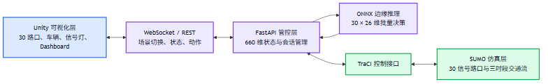
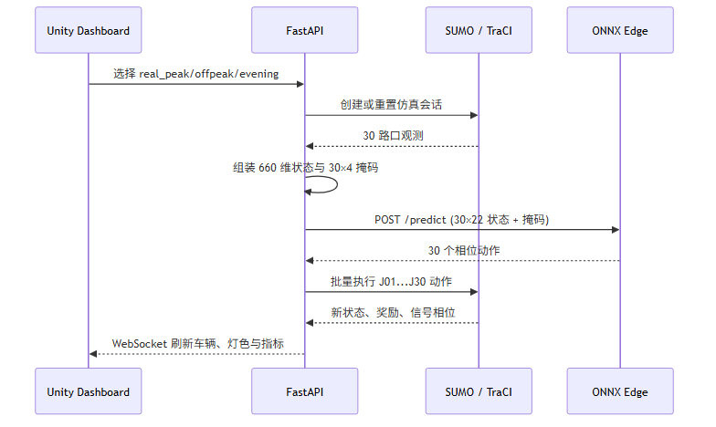
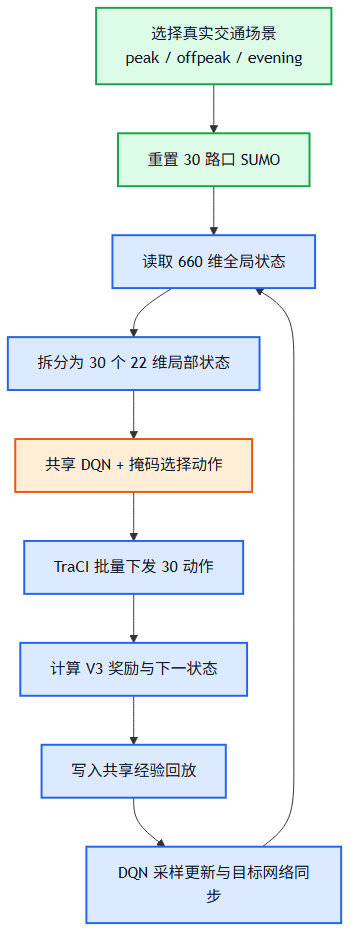
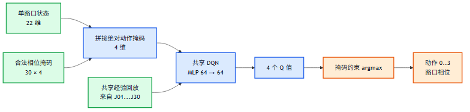
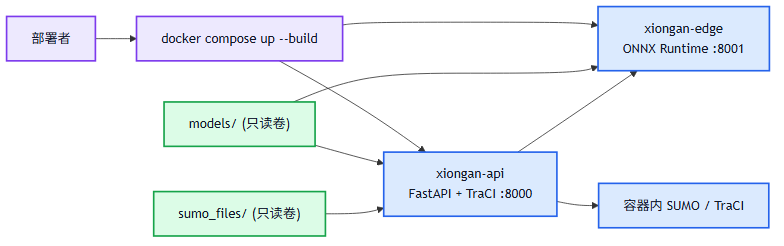

# 雄安新区车路云一体化协同管控系统设计与算法报告

> 版本：2026-08-23（可复现初稿）
> 范围：30 路口 SUMO 仿真、共享掩码 DQN、FP32 ONNX 边缘推理、FastAPI/Unity 联调与容器部署。
> 数据原则：本文只引用仓库内可定位的配置、模型、日志和验证报告；尚未取得的“四策略×30路口”完整对比数据不作数值性结论。

## 摘要

面向雄安新区“窄路密网”下路口间相互影响、排队易溢出和多时段交通需求差异的问题，本项目构建了一个覆盖仿真、决策、边缘部署和三维展示的车路云协同管控平台。系统以 30 个可控信号路口为对象，采用“局部观测、参数共享、批量执行”的多路口控制方法：公开状态为 `30 × 22 = 660` 维；单路口在 22 维状态上追加 4 维绝对动作掩码，形成 26 维 DQN 输入；一次控制周期返回并执行 30 个相位动作。正式部署使用与教师 SB3 模型真实 SUMO 状态动作一致率为 100% 的 FP32 ONNX 模型，单路口平均推理约 0.022–0.023 ms、30 路口批量平均推理约 0.029–0.031 ms。Unity–WebSocket–SUMO–ONNX 已完成三场景闭环记录和 30 分钟稳定性复验。

本文同时补齐容器化设计：SUMO、TraCI、FastAPI 和 ONNX Runtime 在同一可复现运行时镜像中安装；`xiongan-api` 将当前 660 维状态拆分为 30 个局部状态并调用 `xiongan-edge` 批量推理，模型与路网均以只读卷挂载。该设计将模型格式、接口契约和可视化运行链路明确分离，便于后续补充正式四策略全量评估。

**关键词：** 车路云协同；自适应信号控制；参数共享 DQN；动作掩码；SUMO；ONNX；Unity

---

## 1. 问题背景与目标

### 1.1 问题定义

在高密度城市路网中，一个路口的放行会改变相邻路口的到达流和排队分布；仅依赖固定配时难以适配早、平、晚高峰的需求变化。本项目将控制对象定义为 30 个有信号控制的路口 `J01`–`J30`，在每个离散控制周期同时选择四类相位之一：南北直行、南北左转、东西直行、东西左转。

工程目标如下。

| 目标 | 本项目的可验收定义 |
|---|---|
| 路网规模 | SUMO 与 Unity 均固定识别 `J01`–`J30` 共 30 个路口 |
| 状态契约 | 服务端向算法与可视化公开 660 维 `v1-30x22` 状态 |
| 决策约束 | 30 个路口各 4 个动作；无需求相位由绝对掩码禁止 |
| 低时延部署 | 正式 FP32 ONNX 模型小于 1 MB，保持真实状态动作一致性 |
| 演示闭环 | Unity 场景切换、SUMO 状态、模型动作、信号灯和车辆刷新可追溯 |

### 1.2 技术路线

系统不将 Unity 当作交通仿真真值来源。SUMO/TraCI 负责交通演化和信号执行；FastAPI 负责会话、状态、约束和接口契约；共享 DQN 或 ONNX 边缘模型负责动作选择；Unity 通过 WebSocket 接收快照并渲染。这避免了把视觉状态误用于训练或控制。



源码图：[`figures/system-architecture.mmd`](../figures/system-architecture.mmd)。

---

## 2. 系统总体设计

### 2.1 三层架构与职责边界

| 层级 | 主要组件 | 职责 | 关键输入/输出 |
|---|---|---|---|
| 可视化层 | Unity、`SumoVisualizationBridge.cs`、Dashboard | 路网、车辆、30 盏灯和指标展示；发送场景切换 | WebSocket 快照、REST/WS 场景指令 |
| 管控层 | `server/api_server.py`、`server/visualization_server.py` | 会话、状态校验、动作批量执行、模型登记和错误返回 | 660 维状态、30×4 掩码、30 动作 |
| 仿真层 | SUMO、TraCI、`sumo_files/` | 路网加载、真实交通流、相位执行、检测器统计 | 车道状态、相位、车辆与奖励指标 |
| 边缘推理层 | `edge_deploy/inference_server.py`、ONNX Runtime | 加载正式 ONNX 并做单路口/30 路口批量推理 | `N×22` 状态 + `N×4` 掩码 → `N` 动作 |

### 2.2 一次控制周期

1. Unity 选择 `real_peak`、`real_offpeak` 或 `real_evening`；服务端启动或重置对应 SUMO 会话。
2. TraCI 读取 30 个路口的局部特征，按固定路口顺序拼接为 660 维状态。
3. 服务端计算每个路口的 4 维绝对动作掩码；22 维状态和掩码供模型组成 26 维观测。
4. ONNX 服务对 30 行观测批量输出 30 个动作；服务端检查动作集合完整、掩码合法和最小绿灯/黄灯约束。
5. TraCI 同一时刻批量下发 `J01`–`J30` 的实际执行动作，推进仿真，随后向 Unity 广播新快照。



这一批量机制避免逐路口推进造成“同一帧内不同路口读取到不同仿真时刻”的不一致。

### 2.3 接口与错误处理

基础 API 为 `http://localhost:8000/api/v1`，主要接口为：

| 接口 | 用途 |
|---|---|
| `GET /health` | API、SUMO 可用性与当前会话状态 |
| `POST /simulation/start` | 启动指定真实场景 |
| `GET /simulation/state` | 返回 660 维状态与路口切片 |
| `POST /model/predict` | SB3 模型推理（开发/回归） |
| `POST /edge/predict` | API 调用 ONNX 边缘容器，返回 30 个动作 |
| `POST /simulation/actions` | 校验并批量执行 30 个动作 |
| `GET /edge/health` | 透传检查容器网络内的 ONNX 服务 |

服务端拒绝缺失路口、非法动作、过期 `transition_id`、缺失 SUMO 资产或不可达边缘服务；这些失败均返回结构化错误，而不是以零值或旧帧继续执行。完整对外契约见 [`docs/接口文档.md`](接口文档.md)。

---

## 3. 30 路口仿真环境

### 3.1 路网与信号约束

路网配置位于 [`sumo_files/xiongan_30.net.xml`](../sumo_files/xiongan_30.net.xml) 与 [`sumo_files/xiongan_30.sumocfg`](../sumo_files/xiongan_30.sumocfg)。统一路口顺序在 [`configs/constants.py`](../configs/constants.py) 中定义为 `J01`–`J30`。每个路口有 4 个可控相位，控制器同时执行最小绿灯 15 s 与黄灯过渡 3 s 的安全约束。



### 3.2 状态、动作与掩码

每个路口公开 22 维特征，整个路网状态维度恒为 660，特征划分如下。

| 局部索引 | 特征 | 维度 | 归一化/编码 |
|---:|---|---:|---|
| 0–3 | N/S/E/W 排队长度 | 4 | `min(queue/15, 1)` |
| 4–7 | N/S/E/W 平均等待时间 | 4 | `min(wait/120, 1)` |
| 8–11 | N/S/E/W 车道占有率 | 4 | `[0,1]` 原值 |
| 12–15 | N/S/E/W 溢出风险 | 4 | `min(queue/15, 1)` |
| 16–19 | 当前相位 | 4 | One-Hot |
| 20–21 | 时段特征 | 2 | `sin/cos` 周期编码 |

模型不直接把 660 维公共状态送入一个 120 维联合动作头，而是将其拆为 30 个局部状态。每个局部状态再附加 4 位动作掩码，输入尺寸为 `22 + 4 = 26`。掩码为 0 的相位不参与 `argmax`，从而避免无车需求相位被选中后形成自强化的空放行。



### 3.3 三时段真实交通流

真实场景统计来自 [`sumo_files/real_scenario_stats.json`](../sumo_files/real_scenario_stats.json)。三个场景均使用 7,200 s 时间窗，但车辆规模和需求因子不同。

| 场景 | 路由文件 | 车辆数 | 时间窗 | demand factor |
|---|---|---:|---:|---:|
| `real_peak` | `xiongan_real_peak.rou.xml` | 51,868 | 7,200 s | 0.48 |
| `real_offpeak` | `xiongan_real_offpeak.rou.xml` | 44,947 | 7,200 s | 0.60 |
| `real_evening` | `xiongan_real_evening.rou.xml` | 50,296 | 7,200 s | 0.42 |

这些数据描述的是仿真输入规模，不等同于某一种控制策略的完成量或效果指标。

---

## 4. 共享掩码 DQN 方法

### 4.1 参数共享决策

30 个路口共享一套 DQN 参数和经验回放池，而不是维护 30 套独立网络。每个路口仍按自身的 22 维观测和掩码独立选择动作。因此，系统在保持局部执行的同时，使不同拓扑模板和不同场景的经验共同更新同一策略。

正式模型契约为 `shared-dqn-26x4-v1`：输入为 26 维，网络为两层 64 单元 MLP，输出 4 个 Q 值。路网中的不同信号模板及其训练采样权重由 [`configs/constants.py`](../configs/constants.py) 明确记录；少数模板被加权，减少主流模板对梯度的垄断。

### 4.2 DQN 更新目标

对转移 `(s,a,r,s')`，DQN 的 TD 目标写为：

\[
y = r + \gamma (1-d)\max_{a' \in \mathcal{A}(s')} Q_{\theta^-}(s',a')
\]

其中 \(\mathcal{A}(s')\) 是由动作掩码给出的合法集合。优化目标为最小化
\[
\mathcal{L}(\theta)=\mathbb{E}\left[(y-Q_\theta(s,a))^2\right].
\]

经验回放打散连续仿真样本的相关性，目标网络 \(\theta^-\) 稳定 TD 目标；训练时 ε-贪婪探索仅从合法动作中采样。在线执行时固定为确定性掩码 `argmax`。

### 4.3 奖励与安全边界

仓库实现的基础奖励由平均排队、最大排队、平均等待、溢出风险、切换成本与不均衡项组成：

\[
r = -\left(\overline q + 0.5q_{max} + 0.3\overline w + 2.0p_{overflow} + 0.2c_{switch} + 0.1p_{balance}\right).
\]

其中溢出项权重较高，用于强调窄路密网中上游排队回堵的风险。需要注意：当前接口文档中“V5.1”标签与实现中 `REWARD_VERSION = v3` 的命名尚未完全统一；报告和后续实验应以实际运行时输出的 reward version 与奖励函数哈希为准，不能混用名称比较。

---

## 5. 模型交付与边缘轻量化

### 5.1 正式模型选择

正式模型注册在 [`configs/model_registry.json`](../configs/model_registry.json) 与 [`configs/edge_model_registry.json`](../configs/edge_model_registry.json)。三场景的 ONNX 选择如下。

| 场景 | 模型 ID | ONNX 文件 | 教师训练步数 | 状态 |
|---|---|---|---:|---|
| `real_peak` | `edge-real-peak-onnx-v1` | `models/edge/peak/model.onnx` | 1,000,000 | ready |
| `real_offpeak` | `edge-real-offpeak-via-evening-onnx-v1` | `models/edge/evening/model.onnx` | 1,000,000 | ready |
| `real_evening` | `edge-real-evening-onnx-v1` | `models/edge/evening/model.onnx` | 1,000,000 | ready |

平峰使用晚高峰模型是经注册的泛化模型别名；平峰专用模型曾出现病态训练，已归档而未作为正式部署模型。

### 5.2 保真度、大小与延迟

依据 [`docs/轻量化验证报告_20260820.md`](轻量化验证报告_20260820.md) 和 [`models/edge/real_state_validation.json`](../models/edge/real_state_validation.json)：

| 指标 | peak FP32 ONNX | evening FP32 ONNX |
|---|---:|---:|
| 文件大小 | 25,742 B（约 25.14 KB） | 25,742 B（约 25.14 KB） |
| 单路口平均推理 | 0.022 ms | 0.023 ms |
| 30 路口批量平均推理 | 0.029 ms | 0.031 ms |
| 真实 SUMO 状态动作一致率 | 100% | 100% |

真实状态验证覆盖早、平、晚三个场景，以及 `J01/J05/J10/J15/J20/J21/J25/J30` 八个代表路口；每个路口连续 120 个决策状态，共 2,880 条观测。动态 INT8 产物在真实轨迹上未达到保真要求，注册状态为 `experimental_failed_real_state_fidelity`，故不用于正式演示。

### 5.3 容器部署设计

容器配置位于 [`edge_deploy/docker/Dockerfile`](../edge_deploy/docker/Dockerfile) 和 [`edge_deploy/docker/docker-compose.yml`](../edge_deploy/docker/docker-compose.yml)。镜像安装 SUMO、SUMO tools、TraCI 的 Python 依赖、FastAPI 和 ONNX Runtime；模型目录与路网目录通过只读卷挂载，避免运行时覆盖交付物。



`xiongan-edge` 在 8001 端口暴露 `/health` 与 `/predict`；`xiongan-api` 在 8000 端口暴露 API，并依赖边缘服务的健康检查。API 的 `/edge/predict` 将当前会话的 660 维状态拆分为 30×22，再把 30×4 掩码和模型 ID 发送至容器网络内的 ONNX 服务，返回的 30 个动作仍需经过服务端安全约束后写入 SUMO。

部署命令：

```powershell
docker compose -f edge_deploy/docker/docker-compose.yml up --build -d
docker compose -f edge_deploy/docker/docker-compose.yml ps
Invoke-RestMethod http://localhost:8001/health
Invoke-RestMethod http://localhost:8000/api/v1/health
```

---

## 6. Unity 闭环与可视化验收

Unity 侧使用 30 路口地图、30 盏信号灯、动态车辆池和实时指标面板。正式闭环联调记录在 [`docs/Unity三场景闭环联调记录_20260821.md`](Unity三场景闭环联调记录_20260821.md)。已记录的三场景采样结果如下。

| 场景 | 正式 ONNX ID | 每帧契约 | 车辆数范围 | 相位覆盖 | 结果 |
|---|---|---|---:|---|---|
| `real_offpeak` | `edge-real-offpeak-via-evening-onnx-v1` | 30 灯、30 动作、30×4 掩码 | 443–466 | 0/1/2/3 | PASS |
| `real_evening` | `edge-real-evening-onnx-v1` | 30 灯、30 动作、30×4 掩码 | 286–343 | 0/2/3 | PASS |
| `real_peak` | `edge-real-peak-onnx-v1` | 30 灯、30 动作、30×4 掩码 | 286–345 | 0/1/2 | PASS |

在正式早高峰模型上的 30 分钟复跑中，记录到 1,279 个有效状态快照，协议错误和无快照超时均为 0；每帧均为 30 盏灯、30 个动作，动态车辆数范围为 400–1,349。服务端主动停止后 Unity 自动重连也已通过记录验证。

---

## 7. 已有实验结论与边界

### 7.1 已可引用的结论

- 推荐的 FP32 ONNX 与正式 SB3 教师在抽样的真实 SUMO 轨迹上动作一致率为 100%，因此格式转换本身不会在该验证窗口内改变教师策略的动作。
- FP32 ONNX 模型约 25 KB，远小于 1 MB 的体积约束；30 路口批量推理均值小于 0.1 ms，满足部署时延预算。
- 三场景 Unity 闭环、动作掩码审计、30/30 信号灯映射、车辆刷新、30 分钟稳定性和断线重连均有可定位记录。

### 7.2 当前不能扩展的结论

尚不能将下列内容写成“已完成的 30 路口最终结论”：

1. 固定配时、独立 DQN、共享 DQN、其他算法四策略在**相同 30 路口三场景、同一随机种子组**上的完整 Mobility/Environment/Safety 对比；
2. 完整 30 路口的多次重复实验、显著性检验和置信区间；
3. 所有超参数组合的统一扫参曲线；
4. 安全指标（冲突、碰撞、急减速等）在不同策略下的同口径统计。

这些数据应由 `evaluation/metrics_collector.py` 统一采集，并将每一策略、场景、随机种子、模型哈希、路网哈希、SUMO 版本写入结果元数据。报告中过去若存在由相对 reward 外推到“固定配时指标”的表格，应在正式答辩稿中删除或显著标记为非正式示例。

---

## 8. 创新点与工程贡献

1. **30 路口共享掩码 DQN 契约。** 保持 660 维公开状态可被 Unity 和服务端稳定消费，同时在模型内部采用 22+4 的局部决策契约，避免公共 API 因模型实现变化而破坏。
2. **拓扑差异下的合法动作约束。** 对不同信号模板按当前需求生成绝对动作掩码，避免无车相位被选中，降低共享策略在少数拓扑上的相位锁死风险。
3. **从教师模型到可部署模型的可验证转换。** ONNX 导出、模型注册、哈希和真实轨迹动作一致性验证共同构成部署门槛；不以离线随机状态一致率代替真实状态验证。
4. **闭环可观测性。** 快照中保留 `action_masks`、原始请求动作与实际执行动作，使“模型想做什么”“安全约束实际执行什么”可区分、可审计。
5. **可复现服务化。** 通过 Compose 把 SUMO/TraCI、API 和 ONNX 推理解耦为可健康检查的服务，模型和路网使用只读挂载，降低环境漂移风险。

---

## 9. 局限性与后续实验计划

当前平峰正式部署使用晚高峰模型泛化，不应表述为“平峰专用模型最佳”。另一个工程待办是统一奖励版本命名，以免接口文档和运行时标签不一致。容器化代码完成后仍需在目标机器实际拉取依赖并通过一次 `docker compose up` 的 SUMO/TraCI 联动验收。

为完成最终实验评估报告，建议按以下矩阵补齐数据：

| 维度 | 取值 |
|---|---|
| 控制策略 | Fixed-Time、独立 DQN、共享掩码 DQN、候选对照算法 |
| 场景 | real_peak、real_offpeak、real_evening |
| 随机种子 | 至少 3 个，固定并记录 |
| 路网规模 | 8 路口诊断集与 30 路口正式集分开报告 |
| 指标 | 平均行程时间、平均等待、平均/最大排队、吞吐量、碰撞/传送、推理延迟 |

最终答辩可基于已完成的闭环和可视化部分录制系统演示，但涉及策略优劣的旁白必须以这套同口径正式评估结果为准。

---

## 10. 可复现清单

| 类别 | 文件/命令 |
|---|---|
| 路网与场景 | `sumo_files/xiongan_30.sumocfg`、`sumo_files/real_scenario_stats.json` |
| 状态/动作契约 | `configs/constants.py`、`docs/接口文档.md` |
| 教师模型注册 | `configs/model_registry.json` |
| 边缘模型注册 | `configs/edge_model_registry.json` |
| ONNX 推理 | `edge_deploy/inference.py`、`edge_deploy/inference_server.py` |
| 容器部署 | `edge_deploy/docker/Dockerfile`、`edge_deploy/docker/docker-compose.yml` |
| Unity 闭环 | `docs/Unity三场景闭环联调记录_20260821.md` |
| 轻量化验证 | `docs/轻量化验证报告_20260820.md`、`models/edge/real_state_validation.json` |

本报告所含 Mermaid 原始图在 [`figures/`](../figures/) 目录，能使用 Mermaid CLI 重新渲染为 PNG，方便在 Word/PPT 中继续编辑和引用。
