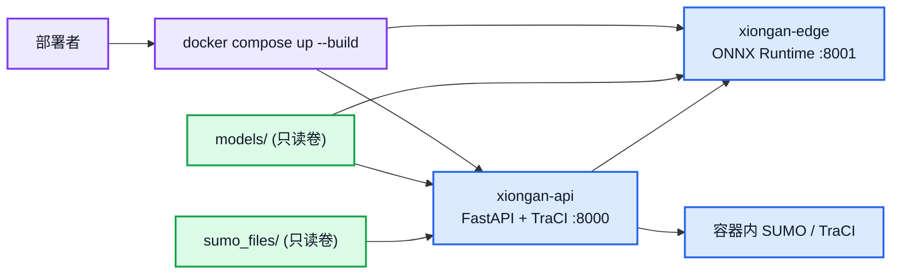

# 容器部署与服务联动

Compose 以只读卷挂载模型和路网，API 调用同网络中的 ONNX 边缘服务。

```mermaid
flowchart LR
    Operator["部署者"] --> Compose["docker compose up --build"]
    Compose --> Edge["xiongan-edge<br/>ONNX Runtime :8001"]
    Compose --> API["xiongan-api<br/>FastAPI + TraCI :8000"]
    Models["models/ (只读卷)"] --> Edge
    Models --> API
    SumoFiles["sumo_files/ (只读卷)"] --> API
    API --> Edge
    API --> SUMO["容器内 SUMO / TraCI"]
    classDef orchestrator fill:#ede9fe,stroke:#7c3aed,color:#111827,stroke-width:2px;
    classDef service fill:#dbeafe,stroke:#2563eb,color:#111827,stroke-width:2px;
    classDef asset fill:#dcfce7,stroke:#16a34a,color:#111827,stroke-width:2px;
    class Operator,Compose orchestrator;
    class Edge,API,SUMO service;
    class Models,SumoFiles asset;
```
