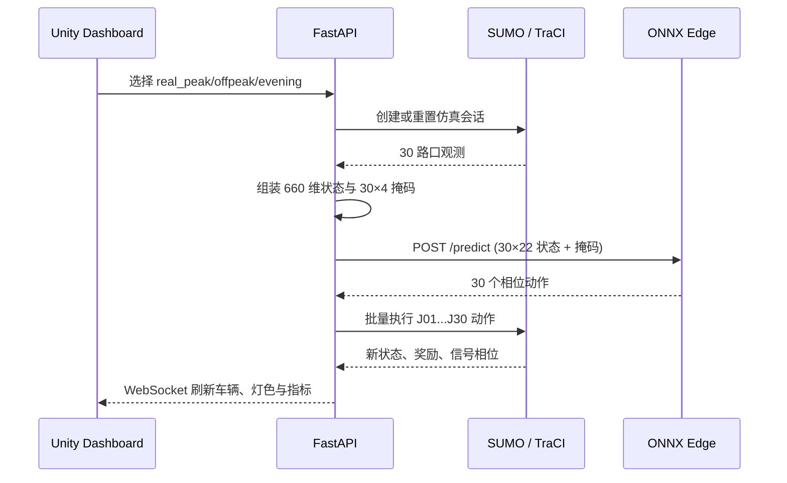

# 单次 30 路口闭环时序

三场景下 Unity、服务端、SUMO 和 ONNX 推理服务的一次控制循环。

```mermaid
sequenceDiagram
    participant U as Unity Dashboard
    participant A as FastAPI
    participant S as SUMO / TraCI
    participant E as ONNX Edge
    U->>A: 选择 real_peak/offpeak/evening
    A->>S: 创建或重置仿真会话
    S-->>A: 30 路口观测
    A->>A: 组装 660 维状态与 30×4 掩码
    A->>E: POST /predict (30×22 状态 + 掩码)
    E-->>A: 30 个相位动作
    A->>S: 批量执行 J01...J30 动作
    S-->>A: 新状态、奖励、信号相位
    A-->>U: WebSocket 刷新车辆、灯色与指标
```
