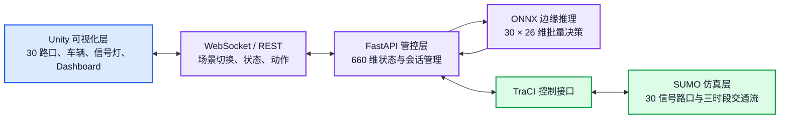

# 车路云协同三层架构

Unity、FastAPI、ONNX 边缘推理与 SUMO 的正式数据和控制关系。

```mermaid
flowchart LR
    Unity["Unity 可视化层<br/>30 路口、车辆、信号灯、Dashboard"]
    WS["WebSocket / REST<br/>场景切换、状态、动作"]
    API["FastAPI 管控层<br/>660 维状态与会话管理"]
    Edge["ONNX 边缘推理<br/>30 × 26 维批量决策"]
    TraCI["TraCI 控制接口"]
    SUMO["SUMO 仿真层<br/>30 信号路口与三时段交通流"]
    Unity <--> WS
    WS <--> API
    API --> Edge
    API <--> TraCI
    TraCI <--> SUMO
    Edge --> API
    classDef visual fill:#dbeafe,stroke:#2563eb,color:#111827,stroke-width:2px;
    classDef service fill:#ede9fe,stroke:#7c3aed,color:#111827,stroke-width:2px;
    classDef simulation fill:#dcfce7,stroke:#16a34a,color:#111827,stroke-width:2px;
    class Unity visual;
    class WS,API,Edge service;
    class TraCI,SUMO simulation;
```
