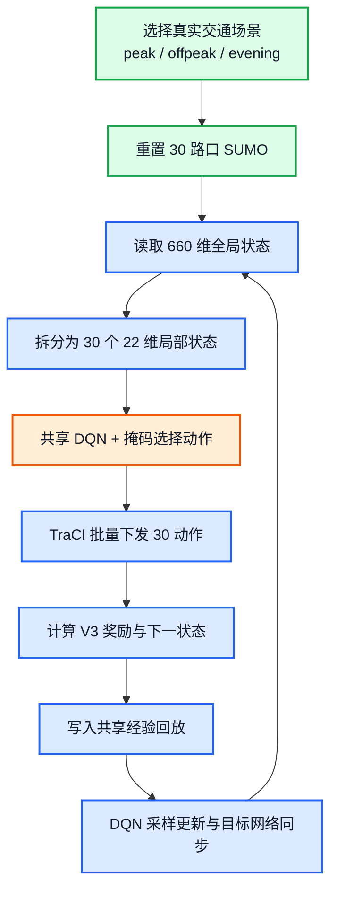

# 共享 DQN 训练流程

每次仿真步均对 30 个路口批量控制，再把经验汇集到共享回放池。

```mermaid
flowchart TD
    Scenario["选择真实交通场景<br/>peak / offpeak / evening"] --> Reset["重置 30 路口 SUMO"]
    Reset --> Observe["读取 660 维全局状态"]
    Observe --> Split["拆分为 30 个 22 维局部状态"]
    Split --> Decide["共享 DQN + 掩码选择动作"]
    Decide --> Apply["TraCI 批量下发 30 动作"]
    Apply --> Reward["计算 V3 奖励与下一状态"]
    Reward --> Replay["写入共享经验回放"]
    Replay --> Learn["DQN 采样更新与目标网络同步"]
    Learn --> Observe
    classDef process fill:#dbeafe,stroke:#2563eb,color:#111827,stroke-width:2px;
    classDef source fill:#dcfce7,stroke:#16a34a,color:#111827,stroke-width:2px;
    classDef decision fill:#ffedd5,stroke:#ea580c,color:#111827,stroke-width:2px;
    class Scenario,Reset source;
    class Observe,Split,Apply,Reward,Replay,Learn process;
    class Decide decision;
```
